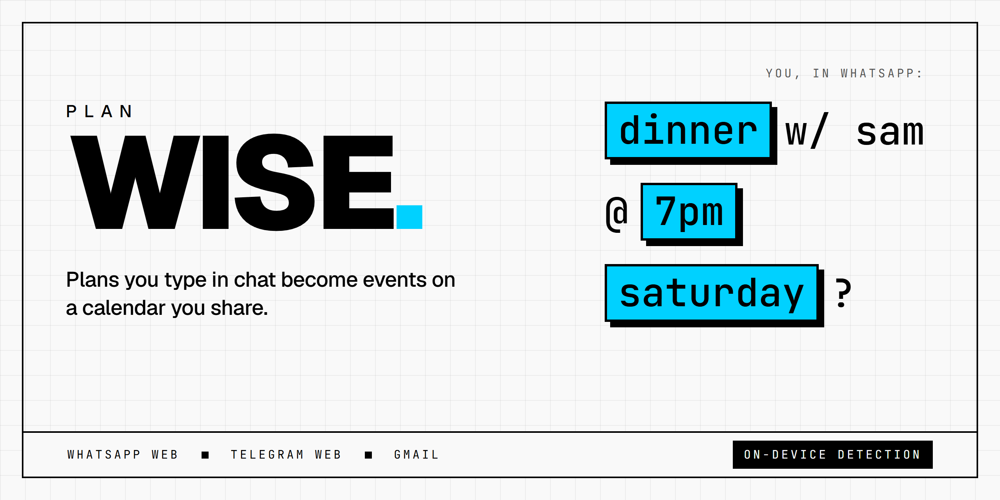
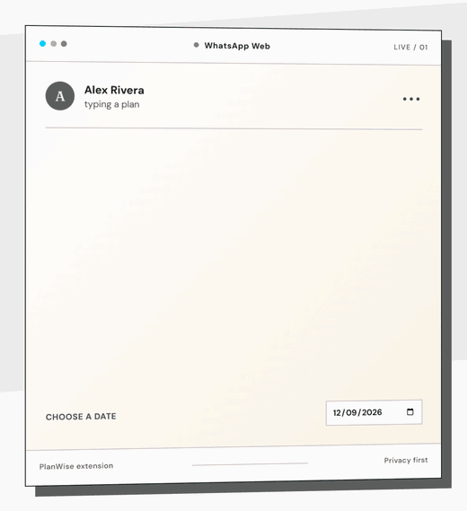
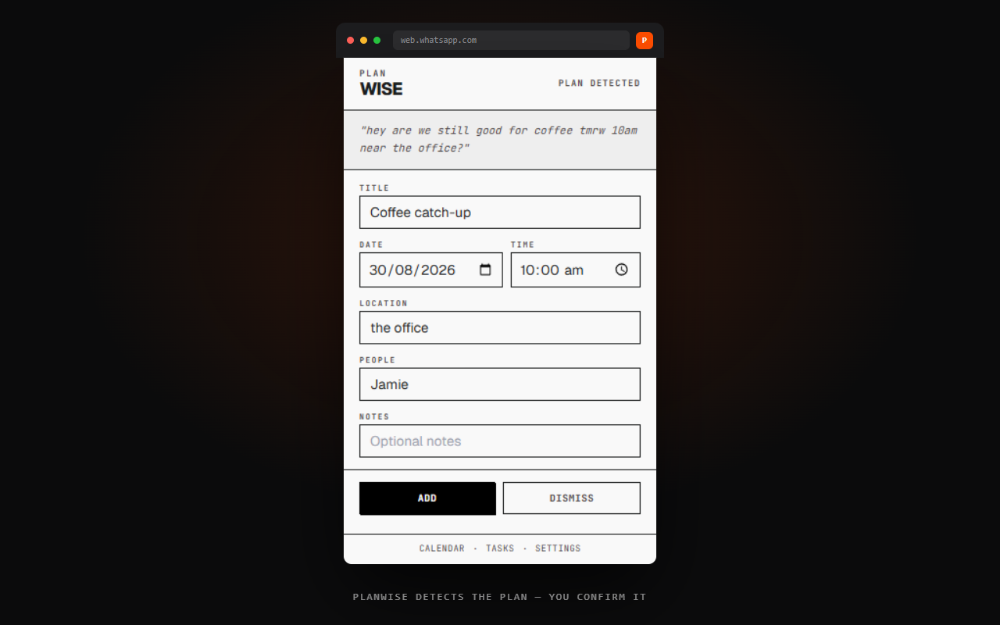
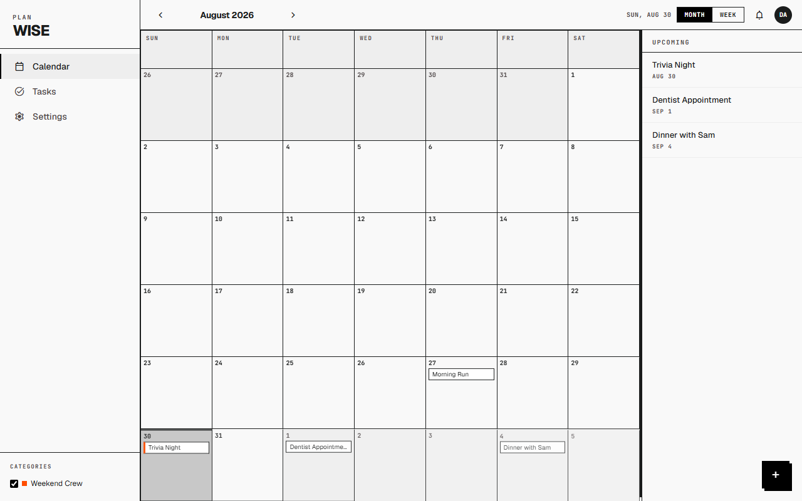
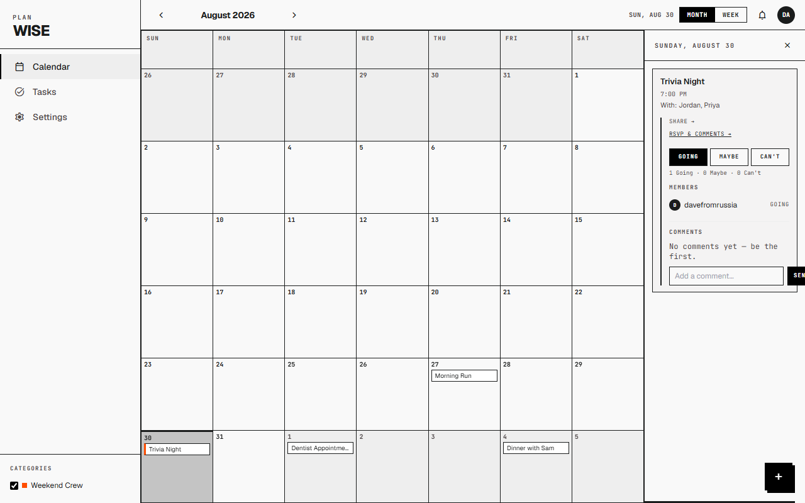
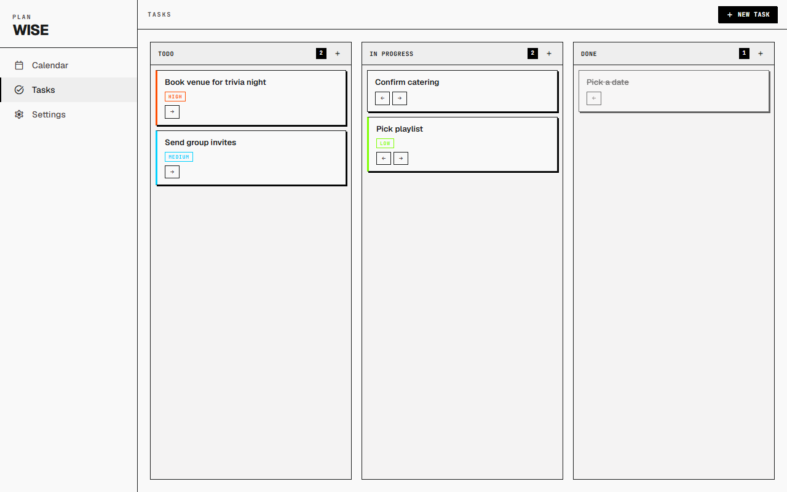
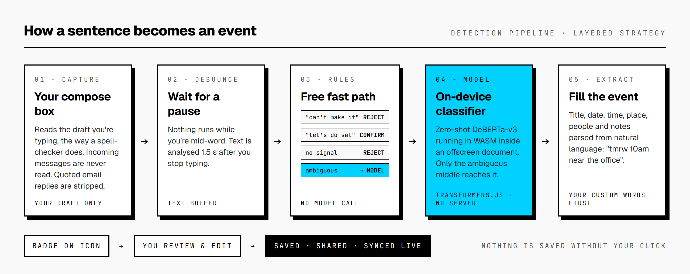

<p align="center">
  
</p>

<p align="center">
  <a href="https://planwise-eosin.vercel.app"><b>Website</b></a>
  &nbsp;·&nbsp;
  <a href="#getting-started"><b>Install</b></a>
  &nbsp;·&nbsp;
  <a href="#how-detection-works"><b>How it works</b></a>
  &nbsp;·&nbsp;
  <a href="https://planwise-eosin.vercel.app/privacy.html"><b>Privacy</b></a>
</p>

<p align="center">
  
  
  
  
</p>

---

Plans get made in group chats and then forgotten there. Someone says *"dinner saturday at 7?"*, everyone says yes, and nobody puts it in a calendar.

**PlanWise is a Chrome extension that notices when you've just typed a plan** in WhatsApp Web, Telegram Web or Gmail. It pulls out the what, when, where and who, and turns that into an event you can confirm with one click. Events go on a shared calendar where your group can RSVP and comment in real time.

It only reads **your own compose box**, never other people's messages. Detection runs **on your machine**, so the text you type isn't sent to any server.

<p align="center">
  
</p>

## A look inside

<table>
  <tr>
    <td width="50%" valign="top">
      
      <p><b>Detected, pre-filled, waiting for you.</b> From <i>"coffee tmrw 10am near the office"</i> PlanWise fills in the title, date, time, place and person. You fix anything it got wrong and press Add. Nothing is saved until you do.</p>
    </td>
    <td width="50%" valign="top">
      
      <p><b>One calendar for everything you've agreed to.</b> Month and week views, a mini-calendar for jumping around, and events from every group you're in, colour-coded.</p>
    </td>
  </tr>
  <tr>
    <td width="50%" valign="top">
      
      <p><b>Share it and see who's coming.</b> Share an event to a group. Members RSVP Going, Maybe or Can't and discuss it in a comment thread that updates live.</p>
    </td>
    <td width="50%" valign="top">
      
      <p><b>The prep work around a plan.</b> A kanban board with priorities and deadlines. Deadlines show up on the calendar automatically.</p>
    </td>
  </tr>
</table>

## How detection works

<p align="center">
  
</p>

Most messages are easy to classify. *"Can't make it tonight"* is clearly not a new plan, and *"let's do Saturday"* clearly is. PlanWise handles those with hand-written rules that cost nothing to run. Only the messages that are genuinely ambiguous go to a zero-shot classifier ([DeBERTa-v3 xsmall](https://huggingface.co/MoritzLaurer/deberta-v3-xsmall-zeroshot-v1.1-all-33)). The classifier runs through [Transformers.js](https://github.com/huggingface/transformers.js) in WASM inside an offscreen document, so the text never leaves the browser.

That hybrid wasn't a guess. I benchmarked three strategies against 96 hand-labelled messages before choosing the default:

| Strategy | Precision | Recall | F1 |
|---|---|---|---|
| Rules only (original engine) | 100.0% | 53.8% | 70.0% |
| Model only | 64.9% | 96.2% | 77.5% |
| **Layered: rules first, then the model (shipped)** | 78.1% | 96.2% | **86.2%** |

The rules alone never raised a false alarm, but they missed almost half of real plans. The model alone caught nearly every plan, but it also flagged cancellations and past-tense messages (*"we had dinner last night"*). Running the rules first removes most of those false positives, and the model still catches what the rules miss. You can reproduce the numbers with `npm run bench`. The method and every mismatch are written up in [`tests/benchmark/`](tests/benchmark/README.md).

Once a message counts as a plan, a separate extractor parses natural-language dates and times (*tmrw*, *next Friday*, *at 8pm*), places, people (*with Alex*, *meet Sarah and James*) and reminders (*don't forget to bring…*). The words you add in Settings are checked before the built-in lists. That means your team's "standup" or your friend "Coach Kim" get recognised.

## Privacy

- **Your own text only.** The content script reads the compose box you're typing in. It never reads the message list. Quoted text in Gmail replies is removed before analysis.
- **On-device inference.** The classifier runs locally. The only network traffic for it is a one-time download of the model weights from Hugging Face.
- **You confirm everything.** A detected plan is a suggestion. Nothing reaches your calendar until you press **Add**.
- **Row-level security.** Every table in Postgres is protected by RLS policies, so you can only read your own events and the events shared to groups you belong to.

## Features

| | |
|---|---|
| **Detection** | WhatsApp Web, Telegram Web and Gmail. Choose between the layered and model-only strategies. Add your own trigger words, activities, places and names. |
| **Calendar** | Month and week views, a mini-calendar navigator, a month/year picker, and an upcoming list. Task deadlines appear as their own category. |
| **Groups** | Create groups, invite people by username, and share events. Events shared to more than one group show each group's colour. |
| **Social** | RSVPs, comment threads and a notification bell, all synced live through Supabase Realtime. |
| **Tasks** | Kanban board (Todo / In Progress / Done) with priority, deadline and notes. |
| **Polish** | Light and dark themes. Cached-first rendering so pages load instantly. Graceful "service unavailable" screens when the backend is unreachable. |

## Getting started

PlanWise isn't on the Chrome Web Store yet, so for now you load it unpacked.

```bash
git clone https://github.com/shaaaaneeee/Calendar.git
```

1. Open `chrome://extensions` and switch on **Developer mode**.
2. Click **Load unpacked** and select the `extension/` folder.
3. Click the PlanWise icon, **Sign up**, then open WhatsApp Web, Telegram Web or Gmail and type a plan.

The extension connects to the hosted backend by default.

<details>
<summary><b>Self-hosting the backend</b></summary>

<br>

1. Create a project at [supabase.com](https://supabase.com).
2. In the SQL Editor, run every file in [`supabase/migrations/`](supabase/migrations) in numerical order (`001` → `023`).
3. Put your project URL and anon key in [`extension/utils/supabase-client.js`](extension/utils/supabase-client.js):

   ```js
   const SUPABASE_URL  = 'https://your-project.supabase.co';
   const SUPABASE_ANON = 'your-anon-key';
   ```

4. Optional: paste the templates from [`supabase/email-templates/`](supabase/email-templates) into Dashboard → Auth → Email Templates.

</details>

## Development

```bash
npm install

npm test               # Jest: detection engine, extractor, strategy routing, data store
npx playwright test    # end-to-end against the real unpacked extension
npm run bench          # accuracy benchmark across detection strategies (needs Chrome)
npm run bundle         # rebuild extension/vendor/supabase.js from node_modules
```

The extension is plain JavaScript on Manifest V3, with no build step for the extension code itself. Dependencies such as Supabase, Transformers.js, Tailwind and Anime.js are vendored into `extension/vendor/`, so no remote code is loaded at runtime.

## Built with

**Extension:** Chrome MV3 · vanilla JS · Tailwind (vendored) · Anime.js · Geist & JetBrains Mono<br>
**ML:** Transformers.js · ONNX Runtime (WASM) · DeBERTa-v3 zero-shot<br>
**Backend:** Supabase: Postgres, row-level security, Realtime and Auth<br>
**Landing site:** React + Vite on Vercel<br>
**Testing:** Jest · Playwright

<details>
<summary><b>Repository layout</b></summary>

```
extension/
  background/     service worker: badge, notifications, offscreen lifecycle
  content/        compose-box observer, debounced text buffer
  detection/      rules, scoring engine, strategies, field extractor
  offscreen/      on-device model host (Transformers.js)
  popup/          sign-in + review queue for detected plans
  dashboard/      calendar app
  tasks/          kanban board
  settings/       detection, groups, notifications, account
  utils/          storage, Supabase client, cache-first data store
  vendor/         bundled third-party code
landing/          marketing site (React + Vite)
supabase/         SQL migrations, admin queries, email templates
tests/            Jest unit tests, Playwright E2E, accuracy benchmark
docs/             design specs, implementation plans, store assets
```

</details>

## Roadmap

- [ ] Chrome Web Store release
- [ ] Apply the rules engine's question and habit guards to the model's answers as well, to cut the remaining false positives (e.g. *"are we still on for friday?"*, *"we go every weekend"*)
- [ ] Better location and people extraction using span-based NER (GLiNER)
- [ ] Desktop companion app for native messaging clients

## License

[MIT](LICENSE)

---

<p align="center">
  <sub>Built by <a href="https://github.com/shaaaaneeee">@shaaaaneeee</a></sub>
</p>
